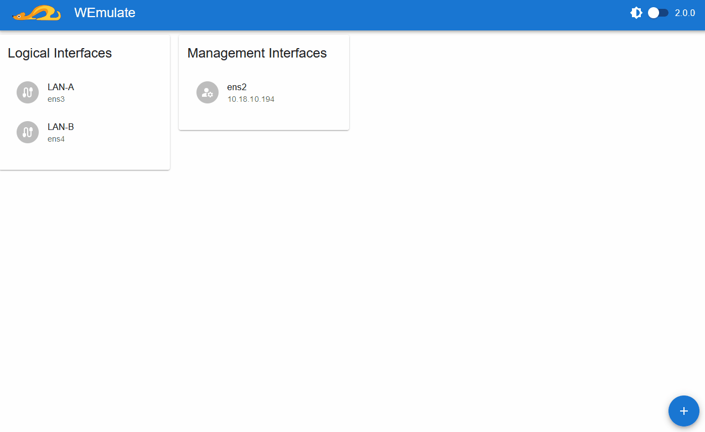

# WEmulate Frontend

This project is the official frontend for the [WEmulate CLI tool](https://github.com/wemulate/wemulate). It is installed with the `--frontend` parameter from the documented install command for [WEmulate](https://github.com/wemulate/wemulate).

## Development

The React app was created with `react-scripts`.
In the project directory, you can run:

### `npm start`

Before running the command, you need to create a `.env.development` file
and set the env variable `REACT_APP_BACKEND_URL_DEV`. It should point to a running instance of [wemulate-api](https://github.com/wemulate/wemulate-api) (e.g. `http://localhost:8080`).

It runs the app in development mode.\
Open [http://localhost:3000](http://localhost:3000) to view it in the browser.

### `npm run build`

Builds the app for production to the `build` folder.\
It correctly bundles React in production mode and optimizes the build for the best performance.
